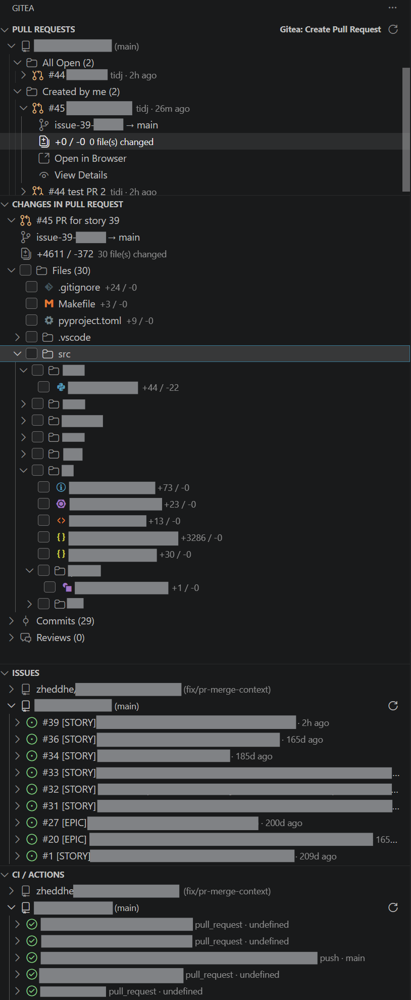

# Gitea for VS Code

A VS Code extension that brings your [Gitea](https://gitea.io) repositories directly into your editor — pull requests, issues, CI/Actions, and inline code review.

---

## Screenshots

**Sidebar — PRs, Issues, CI/Actions with category folders**

**PR detail — inline review, merge, edit form**

**Issue detail — body, comments, edit form**

---

## Features

| Feature | Description |
| --- | --- |
| **Pull Requests** | Browse, filter, merge, close, re-open PRs with category folders (All, Waiting for my review, Created by me) |
| **Inline Code Review** | Diff viewer — click any line to comment, mark files as viewed, submit approve/request-changes/comment reviews |
| **PR Diff Tree** | Dedicated sidebar panel with native file icons, directory tree, checkbox tracking, and `vscode.diff` editor |
| **Issues** | Browse open/closed issues, create, close, re-open, add comments |
| **CI / Actions** | Workflow runs and job statuses, live log streaming, re-run or cancel jobs |
| **Multi-repo** | Automatically detects all git remotes and submodules in your workspace |
| **Status Bar** | Active repo + auth state at a glance |

---

## Requirements

- VS Code **1.85** or later
- Gitea **v1.17+** (Actions support requires a recent version)
- A Gitea **API token** with the correct permissions (see below)

---

## Installation

### From VS Code Marketplace

1. Press `Ctrl+Shift+X` (`Cmd+Shift+X` on Mac) to open Extensions.
2. Search for **"Gitea"** and click **Install**.

### From VSIX

1. Download the latest `.vsix` from the [Releases](../../releases) page.
2. Open the Command Palette (`Ctrl+Shift+P`) → **Extensions: Install from VSIX…**.
3. Select the downloaded file.

---

## Configuration

### Generating a Gitea API Token

1. Log in to your Gitea instance → **Settings → Applications → Access Tokens**.
2. Click **Generate Token** and choose the required scopes:

| Permission | Level | Reason |
| --- | --- | --- |
| **Repository** | Read & Write | Browse PRs, merge, inline review |
| **Issue** | Read & Write | Browse and manage issues |
| **Actions** | Read | View CI runs and job logs |

> `Write` on Repository is needed for merge, approve, close/re-open, and inline review. Use `Read` for read-only access.

3. Copy the token — it is shown **only once**.

### Sign In

After installation, run **`Gitea: Sign In`** from the Command Palette. You will be prompted for your server URL and API token.

### Settings

| Setting | Default | Description |
| --- | --- | --- |
| `gitea.serverUrl` | `""` | Override the Gitea server URL (useful when SSH hostname differs from HTTPS) |
| `gitea.itemsPerPage` | `30` | Number of items per page in tree views |
| `gitea.reviewsPerPage` | `30` | Number of reviews per page |

---

## Usage

### Pull Requests

Open the Gitea icon in the Activity Bar. The **Pull Requests** panel shows PRs grouped by repository and category.

- **Expand a PR** to see branch info, labels, assignees, diff stats.
- **View Details** opens the full PR webview with:
  - **Details tab** — description, stats, inline diff viewer, comments, and review submission form.
  - **Commits tab** — commit list with messages and SHAs.
  - **Activity tab** — review comments timeline.
- **Merge** (merge commit / rebase / squash), **close**, **re-open**, or **edit** (title, body, base branch).
- **Inline review** — click any diff line to add a comment, then submit as Approve, Request Changes, or Comment.

### PR Diff Tree

The **Changes in Pull Request** panel (toggle via `gitea.prDiffVisible` context) provides a navigable directory tree:

- Native file icons from your VS Code icon theme.
- Checkbox tracking per file (mark as viewed).
- Expandable directories with aggregate checkbox state.
- Click a file to open it in the `vscode.diff` editor.

### Issues

The **Issues** panel lists issues per repository:

- Expand an issue to see labels, assignees, milestone, and comment count.
- **View Details** opens a webview with the full body, comments, and an edit form.
- **Close** or **re-open** issues directly.

### CI / Actions

The **CI / Actions** panel shows workflow runs per repository:

- **Manual refresh** via toolbar button or right-click context menus.
- Expand a run to see individual jobs with status badges and duration.
- Click **📋 Logs** on any job to open the **live log streaming panel**.
- Context menu: **Re-run Workflow** or **Cancel Run**.

> **Note**: Job steps are not shown in the tree view due to Gitea API limitations. View the job logs for step-by-step execution details.

---

## Known Limitations

- **Job steps**: Gitea API returns `"steps": null` — step-level details are only available in raw logs.
- **Single token per server**: Multiple users per server are not supported.
- **No GraphQL**: Gitea does not provide a GraphQL API.

---

## Contributing

See [CONTRIBUTING.md](CONTRIBUTING.md).

---

## License

[MIT](LICENSE)
