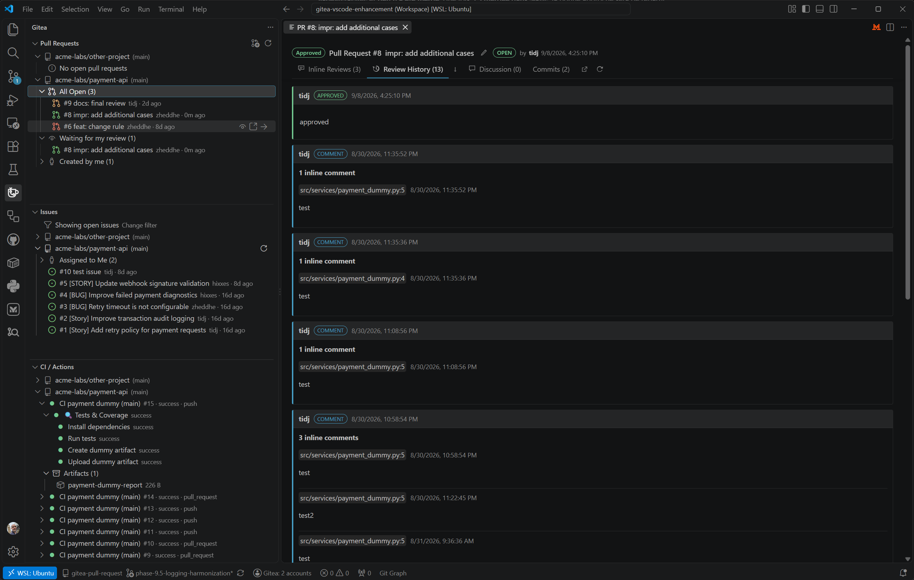
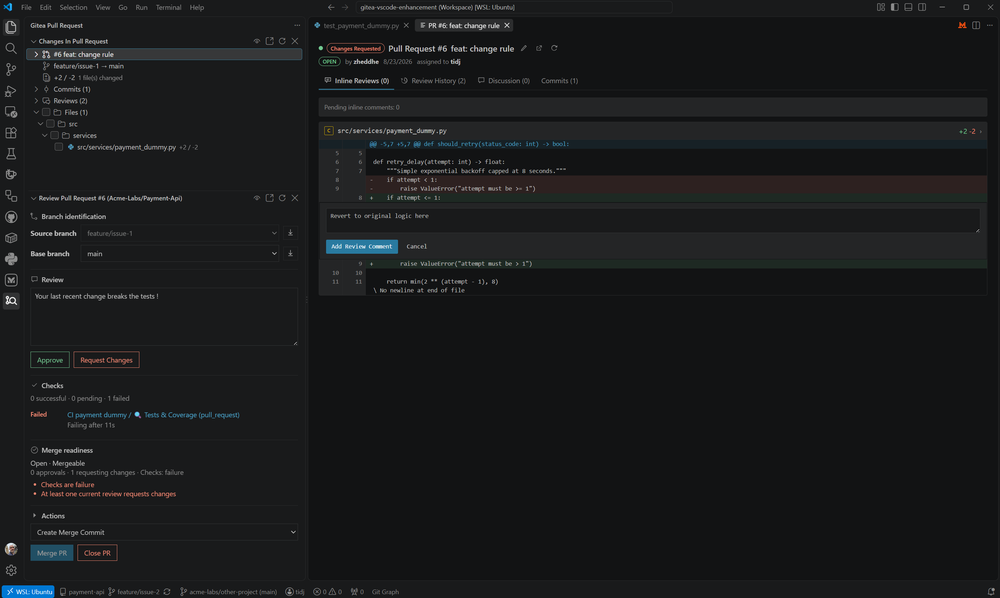
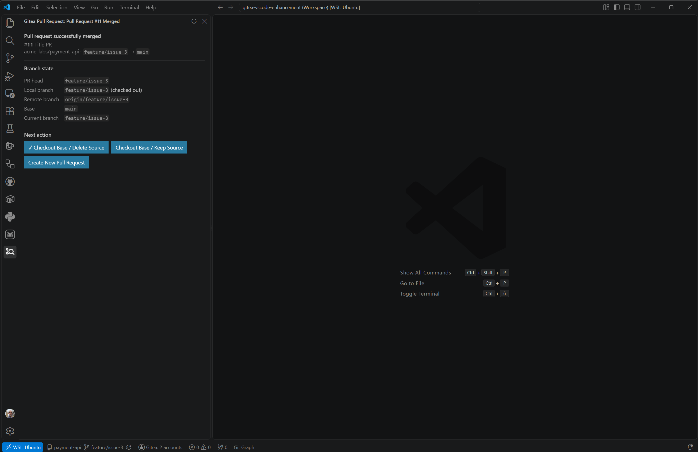
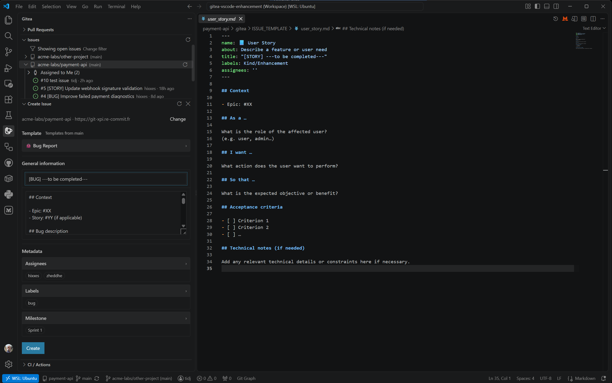

# Gitea Pull Request

**Pull requests, reviews, issues and CI context for self-hosted Gitea, directly in Visual Studio Code.**

Gitea Pull Request provides a sidebar-first workflow for day-to-day Gitea work without trying to replace VS Code itself. Browse forge activity in the general **Gitea** workspace, then move into a dedicated **Gitea Pull Request** workspace when a pull request becomes active.



## Why Gitea Pull Request?

- **Stay in VS Code** for the common pull-request lifecycle: discover, inspect, review, check readiness, merge and clean up branches.
- **Create Issues as a first-class sidebar workflow** with repository templates, Markdown authoring and native metadata selection.
- **Keep workflow state visible** through native TreeViews, status signals, inline row actions and focused detail panels.
- **Review interactively without losing context**: track reviewed files, keep inline conversations actionable, buffer review mutations and submit them together.
- **Move explicitly from review to local development** when needed, while keeping the PR snapshot authoritative for review and the working tree authoritative for edits.
- **Use Gitea CI context where it matters**: browse workflow runs/jobs globally and see PR checks directly in the review workflow.
- **Handle real merge conflicts safely** by preparing the correct local Git state and handing conflicts to native VS Code Source Control / Merge Editor.
- **Work across multiple repositories and forges** without taking ownership of GitHub, GitLab, Bitbucket or Azure DevOps repositories.

## Two workspaces, one workflow

```text
Gitea
├─ Pull Requests
├─ Create Pull Request
├─ Issues
└─ CI / Actions

Gitea Pull Request
├─ Changes in Pull Request
├─ Review Pull Request
└─ Pull Request Merged
```

The general **Gitea** workspace is the forge browser. Pull requests are grouped by repository and useful queues such as **All Open**, **Waiting for my review** and **Created by me**. Issues expose the current Open/Closed scope plus **Assigned to Me**, and CI / Actions shows recent workflow runs and jobs.

Activating a pull request opens the contextual **Gitea Pull Request** workspace. That workspace follows the active PR through review, merge readiness, conflict handling and post-merge cleanup.

## Review a pull request in context



The review workspace brings the relevant decision points together:

- source and base branch identification;
- changed-file navigation with persistent Reviewed/Viewed checkboxes and aggregate progress;
- exact PR/base↔head review snapshots through native VS Code diff integration;
- Approve / Request Changes review actions;
- PR checks and their current result;
- effective review state and merge readiness;
- repository-supported merge method selection;
- Merge / Close actions when appropriate.

Merge readiness stays neutral while checks, reviews and mergeability signals are still being consolidated, so incomplete refresh state is not presented as a final positive or negative conclusion.

Review state is based on each reviewer's latest effective decision. A newer **Request Changes** therefore supersedes an older approval from the same reviewer, and the Changes tree uses the same effective state as Merge Readiness.

Reviewed-file state is kept locally per PR/file and survives normal refresh/reload. When a newer PR head changes a reviewed file, that file is returned to unreviewed while unchanged reviewed files can remain checked.

## Interactive inline review conversations

PR Detail turns persisted inline review comments into living conversations rather than one-shot annotations.

- replies are grouped under one conversation root;
- Gitea same-line/same-anchor comments are reconstructed as one thread even when explicit reply linkage is absent;
- Reply, Resolve and Reopen are exposed only when the connected Gitea server supports the corresponding operation;
- resolved conversations collapse into one compact row by default and can be expanded without changing server state;
- conversations that can no longer be safely anchored to the current diff remain visible as unplaced rather than being attached to the wrong line.

New inline comments, replies and resolve/reopen operations share a **pending review session**. Pending work survives normal refresh and is submitted together through a compact **Submit review changes (N)** action. The extension performs one final refresh after submission and retains failed operations for retry if a partial server error occurs.

Full Reply + Resolve/Reopen interaction has been validated against Gitea 1.27.2. Capability checks keep unsupported actions out of the UI on older compatible servers.

## Review snapshot vs local editing

Review and modification are deliberately treated as two connected but distinct jobs:

```text
Review
base@PR  <->  head@PR
read-only snapshot, authoritative for review/comments

Local development
base@PR  <->  working-tree file
editable, authoritative for modifications/tests
```

The normal file action always opens the exact PR review snapshot. When the source repository and branch can be mapped safely to the workspace, additional explicit actions are available:

- **Open Working File** — open the real local file without switching branches;
- **Checkout Source and Open File** — prepare the exact source branch only after dirty/divergent/head-SHA safety checks;
- **Open Editable PR Diff** — compare the PR base snapshot to the working-tree file when the local file initially matches the reviewed PR head.

The editable diff is clearly labelled as local. Once the working file is modified, it is no longer treated as the authoritative PR head for review anchoring. Commit/push normally, then Refresh the PR to rebind the authoritative review snapshot to the new head.

## Guided conflict resolution

When Gitea reports that a pull request is not mergeable, the extension can prepare a safe local conflict-resolution workflow instead of leaving the user at a dead end.

It verifies a clean working tree, resolves the exact PR source/base remotes, validates the expected PR head, fetches fresh refs, checks out or fast-forwards the source branch safely, and merges the fresh remote base into it. If real conflicts remain, VS Code's native Source Control / Merge Editor takes over. **Abort Merge** uses normal Git merge-abort semantics.

Conflict guidance is CI-aware: a genuinely pending check suppresses premature conflict prompting until checks settle.

## Finish cleanly after merge



After a successful merge, the extension keeps the repository/branch context long enough to offer three explicit next steps:

- **✓ Checkout Base / Delete Source** — recommended cleanup path;
- **Checkout Base / Keep Source**;
- **Create New Pull Request**.

Cleanup resolves local and remote branch identity independently, checks out the real base before deleting a checked-out source branch, and reports partial failures rather than hiding them.

## Pull request details

For inspection that needs more room than the sidebar, PR Detail provides:

- **Inline Reviews** — changed files, inline diff, review conversations and pending review operations;
- **Review History** — approval/request-changes/comment events with inline-review detail;
- **Discussion** — Markdown PR description and top-level comments;
- **Commits** — PR commit history.

The detail view uses the same compact interaction language throughout: metadata and icon actions stay close to the content they affect rather than being pushed to the far edge of a wide editor panel.

Titles, descriptions and discussion comments can be edited inline. The sidebar remains the action-oriented workflow surface; PR Detail focuses on inspection, discussion and inline review.

## Issues

Issues stay in the general Gitea workspace and support:

- Open / Closed filtering;
- **Assigned to Me** aggregation;
- inline **View Details**, **Open in Browser**, **Add Comment** and contextual **Close / Re-open** actions;
- Markdown detail rendering;
- inline title, description and comment editing;
- first-class sidebar Issue authoring.



**Create Issue** opens a temporary authoring workspace while keeping the Issues tree visible. Pull Requests and CI / Actions are compacted for the duration of the creation session and the normal workspace returns after creation or cancellation.

The authoring surface provides:

- explicit target-repository selection in multi-repository workspaces;
- editable Issue title and Markdown description;
- repository templates discovered from `.gitea/ISSUE_TEMPLATE/` on the repository default branch;
- conservative front-matter support for template name/about, title, labels and assignees;
- an explicit **Blank issue** fallback when no template is wanted or available;
- native QuickPick selection for assignees, labels and milestone;
- draft preservation across normal Activity Bar switches and safe Refresh operations.

Template values are seeds, never locked fields. Selecting another template explicitly replaces its seeded title/body and repository metadata; normal refresh does not overwrite user edits. Switching repository keeps portable title/body text while clearing repository-bound template, assignee, label and milestone selections.

Project metadata and arbitrary branch-derived Issue defaults are deliberately not exposed while the extension cannot represent those mappings reliably through supported Gitea APIs.

## CI / Actions

The CI / Actions tree exposes workflow runs and their jobs with meaningful final states instead of a generic `completed` label.

Run-level actions are kept at run level: **Open in Browser**, **Re-run Workflow**, and **Cancel Run** when the run is active. Job rows expose **View Logs** and **Re-run Job** where supported by Gitea.

Job Logs uses a compact detail view with status, run/job/runner metadata, Refresh and Browser actions, plus the aggregated execution log returned by Gitea. It does not invent step-level UI when the server API cannot provide reliable step detail.

PR-specific checks are also shown directly in the contextual Review view.

## Multi-repository and multi-forge workspaces

Repository discovery is scoped to configured/authenticated Gitea endpoints. Public GitHub, GitLab, Bitbucket and Azure DevOps remotes are excluded from implicit Gitea detection, allowing their own VS Code integrations to coexist in the same workspace.

The extension uses two Gitea-specific Activity Bar identities so the general forge browser and active PR lifecycle remain visually distinct from the official GitHub Pull Requests extension.

## Getting started

### Requirements

- VS Code **1.133.0** or later
- Gitea **1.26.4** or later for the established extension baseline
- Gitea **1.27+** for inline review Reply support
- a Gitea API token with the permissions required for the operations you intend to use

### Sign in

Run **`Gitea: Sign In`** from the Command Palette, then provide your Gitea server URL and API token.

Recommended permissions for the full workflow:

| Permission | Level | Purpose |
| --- | --- | --- |
| **Repository** | Read & Write | Browse, review and merge pull requests |
| **Issue** | Read & Write | Browse and manage issues |
| **Misc** | Read | Transversal API operations |
| **User** | Read | Identity/profile lookup |

Read-only usage can use narrower permissions. Write operations naturally require the corresponding Gitea permission.

## Configuration

| Setting | Default | Description |
| --- | --- | --- |
| `gitea.serverUrl` | `""` | Override the detected Gitea web/API hostname |
| `gitea.itemsPerPage` | `20` | Pull request / CI items per page |
| `gitea.reviewsPerPage` | `20` | Reviews per page |

`gitea.serverUrl` is useful when the Git remote hostname differs from the Gitea web/API hostname, for example an SSH alias pointing at an HTTPS Gitea instance.

## Project documentation

The README is intentionally focused on using the extension. Maintainer and project-process documentation lives separately:

- [Contributing](CONTRIBUTING.md) — development setup, validation, logging and contribution conventions
- [Testing](docs/TESTING.md) — test layers and informational coverage baseline
- [Releasing](docs/RELEASING.md) — packaging and release workflow
- [Roadmap](docs/ROADMAP.md) — product evolution and current release phase
- [Changelog](CHANGELOG.md) — user-facing changes by release

Release `0.9.0` completes Phase 8 through [#31 — interactive PR review workspace](https://github.com/zheddhe/gitea-pull-request/issues/31) and [#32 — sidebar-first Issue authoring](https://github.com/zheddhe/gitea-pull-request/issues/32).

## Project origin

Gitea Pull Request is an independent product/version line originating from an earlier MIT-licensed Gitea VS Code extension codebase and a short-lived enhanced fork. Inherited attribution remains preserved in the repository license/history and [NOTICE](NOTICE).

## License

[MIT](LICENSE)
