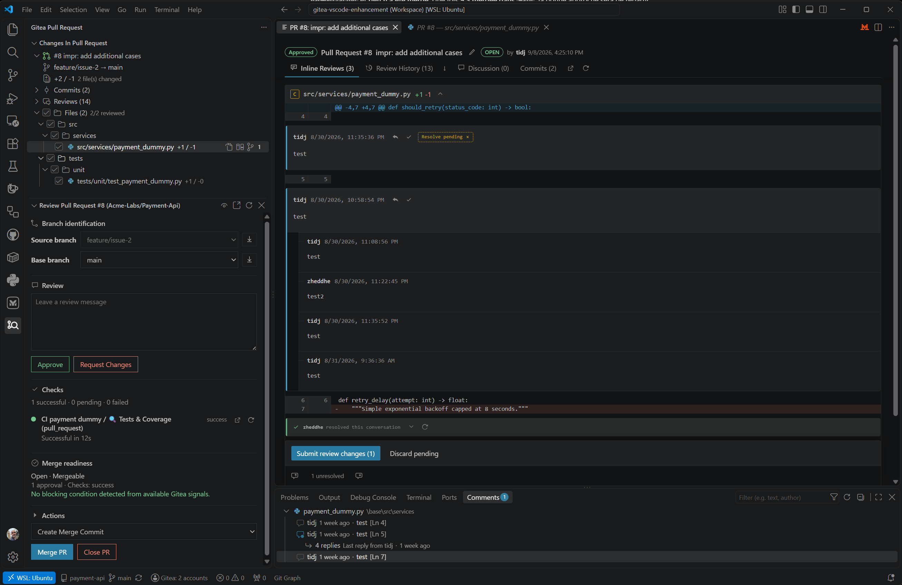
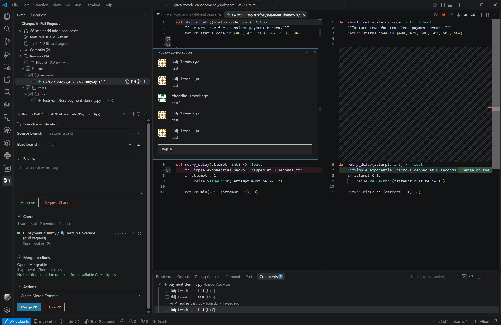

# Gitea Pull Request

**Pull requests, reviews, issues and CI / Actions for self-hosted Gitea, directly in Visual Studio Code.**

Gitea Pull Request provides a native, sidebar-first workflow for day-to-day Gitea work without trying to replace VS Code or Git. It is designed for real self-hosted environments, including multi-repository workspaces, multiple Gitea instances, SSH aliases and least-privilege authentication.


## What you can do

### Pull requests and review

Browse pull requests by repository, activate one into a dedicated **Gitea Pull Request** workspace, inspect exact PR snapshots, track reviewed files and complete the review/merge lifecycle without losing context.

- persistent Reviewed/Viewed progress;
- native VS Code diffs against the authoritative PR base/head snapshots;
- Approve / Request Changes;
- interactive inline review conversations;
- Reply, Resolve and Reopen where supported by the connected Gitea server;
- pending review changes submitted as one review transaction;
- PR checks, effective review state and merge readiness;
- guided merge-conflict preparation using native Git and VS Code Source Control / Merge Editor;
- explicit post-merge branch cleanup.

The PR workspace deliberately exposes two complementary review surfaces. The **overview** keeps the complete pull-request state visible — files, checks, review state and merge readiness — while **inline review** moves the discussion directly into the native VS Code diff for precise file-level feedback.

#### Pull request overview

Use the overview to understand the PR as a whole, navigate changed files, follow review progress and decide whether it is ready to merge.



#### Inline review

Open a changed file in the authoritative PR snapshot to review the diff and manage inline conversations without leaving VS Code. Comments can be prepared as part of the current review transaction, and existing conversations support Reply, Resolve and Reopen when the connected Gitea version exposes those capabilities.



Review and local editing remain deliberately separate:

```text
Review snapshot
base@PR <-> head@PR
read-only and authoritative for review/comments

Local development
base@PR <-> working tree
editable and authoritative for modifications/tests
```

When a PR source branch maps safely to the current workspace, the extension can explicitly open the working file, checkout the source branch, or open an editable local diff. It never silently changes branches just because a review file was opened.

After merge, the contextual workspace keeps the final repository cleanup explicit: return to the base branch and either keep or delete the merged source branch.


### Issues

Issues stay in the main **Gitea** workspace and support browsing, filtering and authoring.

- Open / Closed filtering;
- **Assigned to Me** aggregation;
- View Details, Browser, Add Comment and Close/Re-open row actions;
- Markdown detail rendering and inline editing;
- first-class **Create Issue** workflow;
- `.gitea/ISSUE_TEMPLATE/` discovery from the repository default branch;
- native assignee, label and milestone selection;
- draft preservation across normal workspace navigation and refresh.


### CI / Actions

The CI / Actions tree exposes workflow runs and jobs with their real result state and resource-appropriate actions.

- inspect recent workflow runs and jobs;
- open runs in Gitea;
- re-run workflows and individual jobs where supported;
- cancel active workflow runs;
- inspect job logs and execution detail;
- access artifacts where the server API exposes them reliably;
- see PR-specific checks directly in the Review workspace.

Remote state uses centralized adaptive polling. Refresh cadence follows visibility, VS Code focus, workflow state and recent user activity, backs off when nothing changes, and pauses where automatic refresh could interfere with editing. Polling never mutates the Git working tree.

### Multiple repositories and Gitea instances

A workspace can contain repositories from several Gitea instances and from other forges at the same time.

Repository discovery understands:

- HTTPS remotes;
- SCP-style SSH such as `git@gitea.example:team/repo.git`;
- canonical `ssh://` URLs;
- custom SSH ports;
- OpenSSH aliases from `~/.ssh/config`;
- Git URL rewriting resolved by Git itself.

GitHub, GitLab, Bitbucket and Azure DevOps remotes are not implicitly treated as Gitea. Unknown or ambiguous remotes remain unmapped rather than being probed with a credential.

For installations where the Git transport endpoint and the Gitea web/API endpoint intentionally differ, configure an explicit transport mapping; see [Authentication and multi-instance setup](docs/AUTHENTICATION.md).

## Two workspaces, one workflow

```text
Gitea
├─ Pull Requests
├─ Create Pull Request
├─ Issues
└─ CI / Actions

Gitea Pull Request
├─ Changes in Pull Request
├─ Review Pull Request
└─ Pull Request Merged
```

The general **Gitea** workspace is the forge browser. Activating a pull request opens the contextual **Gitea Pull Request** workspace for review, merge readiness, conflict handling and post-merge cleanup.

## Authentication

Personal Access Tokens are the first-class authentication method for 1.0 and work well with arbitrary self-hosted Gitea instances.

Run **`Gitea: Sign In`** or click the Gitea account entry in the status bar. Each Gitea instance has its own account/session and token. Credentials are stored in VS Code SecretStorage and are never shared across instances.

Recommended least-privilege scopes for the complete workflow:

```text
read:user
write:repository
write:issue
```

For read-only usage:

```text
read:user
read:repository
read:issue
```

Do not use `all` unless you independently need it. `misc` is not required by the extension.

A PAT scope only permits access to an API family; it does **not** elevate the underlying Gitea user's repository permissions. The extension therefore learns effective capabilities from actual API results.

From **Manage Gitea Accounts → Authentication diagnostics**, you can inspect observed states for identity, repository, Issues and Actions without exposing the token.

- `401` means authentication is invalid or revoked;
- `403` means the account is authenticated but lacks the required effective permission/scope;
- a denied capability does not disable unrelated features.

See [`docs/AUTHENTICATION.md`](docs/AUTHENTICATION.md) for multi-instance, SSH and transport-mapping details.

## Status bar and account management

The status bar represents Gitea authentication state, not a hypothetical single active repository.

From it you can:

- manage one or several authenticated Gitea instances;
- replace the PAT for one instance;
- sign out of one instance without affecting the others;
- run authentication diagnostics;
- re-scan repository mappings as a recovery/diagnostic action.

Repository selection itself is automatic and deterministic.

## Configuration

Most users only need to sign in. Explicit configuration is available for more complex self-hosted deployments.

```json
{
  "gitea.servers": [
    {
      "url": "https://gitea.company.example",
      "label": "Company Gitea",
      "transports": [
        {
          "host": "git.internal.example",
          "port": 2222
        }
      ]
    }
  ]
}
```

`transports` is optional and should only be used when normal Git/OpenSSH resolution cannot establish that a Git transport belongs to the configured Gitea API instance.

`gitea.serverUrl` remains available only as a legacy compatibility override; new multi-instance setups should prefer `gitea.servers` and explicit transport mappings.

## Compatibility

- **VS Code:** 1.133.0 or later
- **Gitea minimum supported:** 1.26.4, with capability-gated fallbacks for features not exposed by that server line
- **Gitea recommended:** 1.27.x or later for the complete review experience, including inline Reply and the newest review capabilities
- **Gitea Runner recommended:** 3.x.x or later for the current Actions / CI experience

Gitea 1.26.4 remains a supported compatibility floor rather than the preferred deployment target. The extension degrades unavailable operations independently so PR, Issue or Actions capabilities that remain supported continue to work. Full Reply + Resolve/Reopen interaction has been validated against Gitea 1.27.2.

## Documentation

- [Authentication](docs/AUTHENTICATION.md) — PAT scopes, multi-instance isolation, SSH/HTTPS mapping and diagnostics
- [Roadmap](docs/ROADMAP.md) — product milestones and 1.0 direction
- [Testing](docs/TESTING.md) — test layers and coverage rationale
- [Releasing](docs/RELEASING.md) — release/package workflow
- [Contributing](CONTRIBUTING.md) — development conventions
- [Changelog](CHANGELOG.md) — user-facing release history

## Project origin

Gitea Pull Request is an independent product/version line originating from an earlier MIT-licensed Gitea VS Code extension codebase. Inherited attribution remains preserved in the repository license/history and [NOTICE](NOTICE).

## License

[MIT](LICENSE)
